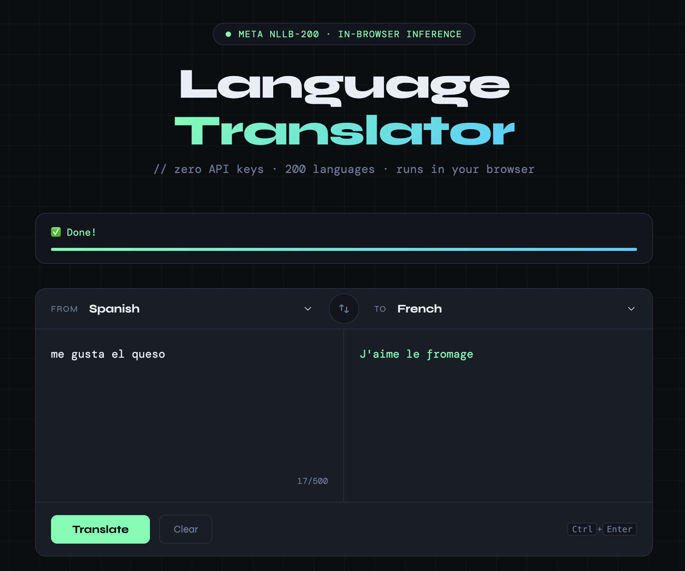

# 🌐 Translator App — Qwen2-0.5B



A lightweight, **100% local** translation app powered by [Qwen2-0.5B-Instruct](https://huggingface.co/Qwen/Qwen2-0.5B-Instruct).  
No API keys, no cloud calls — everything runs on your machine.

---

## ✨ Features

| Feature | Details |
|---|---|
| Model | Qwen2-0.5B-Instruct (≈ 1 GB download) |
| Interfaces | Web UI (Gradio) + CLI |
| Languages | English, Spanish, French, German, Italian, Portuguese, Chinese, Japanese, Arabic, Russian |
| Hardware | CPU or GPU (auto-detected) |

---

## 🚀 Quick Start

### 1. Clone / unzip the project

```bash
unzip translator-qwen.zip   # or: git clone <repo>
cd translator-qwen
```

### 2. Create a virtual environment (recommended)

```bash
python -m venv .venv
source .venv/bin/activate        # Windows: .venv\Scripts\activate
```

### 3. Install dependencies

```bash
pip install -r requirements.txt
```

> **Note:** The first run will download the Qwen2-0.5B model weights (~1 GB) from HuggingFace and cache them locally. Subsequent runs are instant.

---

## 🖥️ Web UI

```bash
python app.py
```

Then open **http://localhost:7860** in your browser.

---

## ⌨️ CLI

### Run the 3 required demo phrases

```bash
python cli.py --demo
```

Expected output:
```
=======================================================
  DEMO — 3 required example phrases
=======================================================

  [English] I like soccer
  [Spanish] Me gusta el fútbol.

  [English] How are you?
  [Spanish] ¿Cómo estás?

  [English] What time is it?
  [Spanish] ¿Qué hora es?

=======================================================
```

### Translate a single phrase

```bash
python cli.py -t "I like soccer" -s English -l French
```

### Interactive mode

```bash
python cli.py
```

---

## 📁 Project Structure

```
translator-qwen/
├── app.py            # Gradio web application
├── translator.py     # Qwen2-0.5B model wrapper
├── cli.py            # Command-line interface
├── requirements.txt  # Python dependencies
└── README.md
```

---

## ⚙️ Hardware Notes

| Hardware | Typical speed per phrase |
|---|---|
| CPU (modern laptop) | ~10–30 s |
| GPU (NVIDIA, CUDA) | ~1–3 s |

For faster CPU inference you can optionally install `llama-cpp-python` and use the GGUF quantized version of the model, but the default setup above works without any extra steps.

---

## 📜 License

This project is released under the MIT License.  
Qwen2 model weights are subject to [Qwen's model license](https://huggingface.co/Qwen/Qwen2-0.5B-Instruct).
